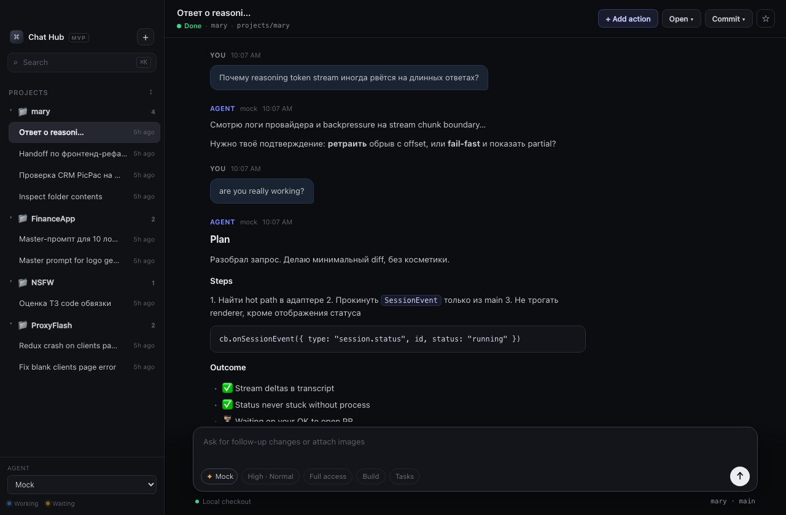

# Chat Hub

[](https://github.com/KolyshkinYafim/chat-hub/actions/workflows/ci.yml)

Chat Hub is a desktop cockpit for AI coding agents: one window that runs Claude Code, Codex, Grok and OpenCode sessions side by side, each in its own project and, optionally, its own git worktree. Around the transcript it adds the working context a coding session actually needs — files, terminal, browser, diffs, a project board — and it stays wired into Session Monitor, the Swift menu-bar app in the sibling repo, so session status and permission prompts follow you outside the window.

Electron · TypeScript · React · pnpm — macOS first.



## Features

- **Multi-provider sessions** — adapters for **Claude Code**, **Codex**, **Grok** and **OpenCode** CLIs (auto-detected on PATH), plus a mock provider for UI work. Streaming transcripts with tool cards, diffs, plans, mermaid diagrams and usage stats; honest status driven by process events, never a stuck "Working".
- **Surfaces dock** — per-session panels next to the chat: file browser with code editor and image/media/PDF preview, real terminal (node-pty + xterm), git diff / source control with per-hunk staging, project board (todos and notes the agent can edit too), embedded browser, and session history.
- **Agent browser control** — any of the four CLIs can drive the Browser surface over MCP: open pages, read them as ref-tagged trees, click, type, screenshot, read console and network logs — in the same webview the user is watching. See [docs/browser-control.md](./docs/browser-control.md).
- **MCP manager** — Settings → Connections edits a per-project server list (`.chathub/mcp.json`) and materializes it into each provider's native config format.
- **Voice dictation** — hands-free composer input through [Handy](https://handy.computer), a local dictation app; Chat Hub never touches audio.
- **Project context** — four checked-in markdown files (`.chathub/context/`: overview, stack, conventions, current focus) seeded from what the repo already says about itself, edited in the Context surface, and optionally appended to every turn's system prompt together with the board's open todos — with a preview of the exact text and its token cost.
- **Hooks** — per-project automation on `session_start`, `turn_done`, `file_save`, `pre_tool_use`, `post_tool_use`; an action is a follow-up prompt or a shell command.
- **Session Monitor integration** — appends `SessionEvent` lines to a shared JSONL bridge and mirrors CLI permission requests onto the island, so either surface can answer; first decision wins. Contract in [docs/bridge.md](./docs/bridge.md).
- **Worktree-per-session** — a session can start on an isolated branch/worktree under `~/.chathub/worktrees`, keeping parallel agents out of each other's way.
- **Permission broker & publish gate** — tool-use approvals rendered in the transcript with a configurable default mode (YOLO / edits-only / ask), and a pre-push gate that warns exactly what unstaged hunks and untracked files a publish would leave behind.

## Development

Requirements: Node ≥ 20, pnpm (see `packageManager` in package.json), macOS for the full experience.

```bash
pnpm install
pnpm dev          # Electron + Vite HMR
pnpm test         # vitest suite (tests/)
pnpm typecheck    # tsc for main/preload + renderer
pnpm build        # production build to out/
```

Install as a daily driver (build, copy to `/Applications`, launch at login):

```bash
pnpm install:mac      # add --no-login to skip launch-at-login
pnpm status:mac       # does /Applications match this working tree?
pnpm uninstall:mac    # remove app + LaunchAgent (data is kept)
```

## Architecture

Renderer (React) talks over IPC to the main process, where a `SessionManager` owns provider adapters, an event bus, persistence and the surface services. Start with [docs/architecture.md](./docs/architecture.md), then:

- [docs/providers.md](./docs/providers.md) — adapter strategy per CLI
- [docs/browser-control.md](./docs/browser-control.md) — the MCP browser pipeline
- [docs/bridge.md](./docs/bridge.md) — the Session Monitor JSONL contract

## Project layout

```
src/main/            Electron main: session manager, adapters, surfaces, MCP,
                     permission broker, hooks, persistence, Session Monitor bridge
src/main/adapters/   claude / codex / grok / opencode / mock CLI adapters
src/main/surfaces/   files, terminal, board, browser services
src/renderer/src/    React workbench: chat view, sidebar, surfaces dock, settings
src/shared/          IPC and data contracts shared by both processes
resources/mcp/       the zero-dependency browser MCP server the CLIs spawn
tests/               vitest suite
docs/                architecture and product docs (docs/archive/ for history)
packaging/           macOS build/install scripts
```

## Data locations

| What | Where |
|------|-------|
| Sessions + messages | `~/Library/Application Support/chat-hub/data/state.json` |
| Settings | `~/Library/Application Support/chat-hub/data/settings.json` |
| Session Monitor bridge (JSONL) | `~/Library/Application Support/agent-desktop/events.jsonl` (override: `AGENT_DESKTOP_EVENTS`) |
| Per-project MCP servers | `<project>/.chathub/mcp.json` |
| Per-project context | `<project>/.chathub/context/*.md` (switch in `.chathub/context.json`) |
| Session worktrees | `~/.chathub/worktrees/` |

## Env knobs

| Env | Effect |
|-----|--------|
| `CHAT_HUB_DEMO=1` | Seed multi-project demo data on an empty store |
| `CHAT_HUB_PERMISSION` | Default permission mode (`yolo` \| `acceptEdits` \| `default`) if settings are missing |
| `AGENT_DESKTOP_EVENTS` | Override the bridge JSONL path |
