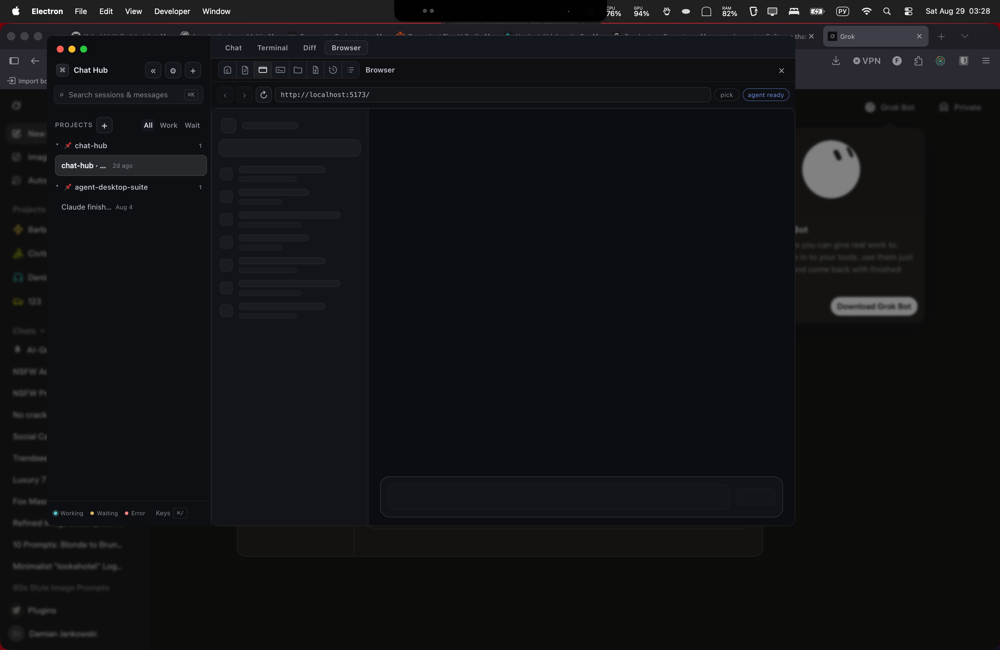

# Cockpit mode — decision document

Experimental, **off by default**, **per window**. Branch `spike/cockpit`.

**Recommendation: ship it with limits.** Glass is feasible on Electron 35 / macOS, idle and dock-surface load are cheap, and the contrast problem is solved without a global dim. Do not turn it on for every window. Do not make `<webview>` guests translucent.

```bash
pnpm dev                  # normal window
pnpm dev:cockpit          # this window starts in cockpit (env)
pnpm dev:cockpit:hud      # hud material
```

Product switch: **Settings → Appearance → This window → Cockpit mode**. Persists on `settings.window.cockpit`. `CHAT_HUB_COCKPIT=1` still forces on at launch for the spike.

---

## Final recipe

| Layer | Choice |
| --- | --- |
| Window | `titleBarStyle: hiddenInset`, traffic lights `{16,16}` |
| Vibrancy | `under-window` + `visualEffectState: 'active'` + `backgroundColor: '#00000000'` |
| Not used | `transparent: true` (kills the blur) |
| Runtime | `win.setVibrancy(type \| null)` — no restart |
| Chrome | Translucent tokens (sidebar `0.66`, elevated `0.55`, borders `rgba(255,255,255,0.09)`) |
| Reading column | Local **scrim** `rgba(12, 13, 18, 0.88)` + `backdrop-filter: blur(20px) saturate(1.2) brightness(0.72)` on `.main` and the staged dock body |
| Guests | Opaque card (`webpreferences="transparent=no"`, solid `#0c0d12` host) |
| Tabs | Chat / Terminal / Diff / Browser drive the **existing SurfaceDock** registry |
| A11y | `@media (prefers-reduced-transparency: reduce)` + `nativeTheme.prefersReducedTransparency` → `setVibrancy(null)` + opaque tokens |
| Motion | `@media (prefers-reduced-motion: reduce)` drops `backdrop-filter` |
| Fullscreen | Vibrancy off while `enter-full-screen` (Ghostty’s rule: native fullscreen + opacity is a grey mess) |

Glass is **not** a picker theme. `applyTheme` overlays tokens only when `html.cockpit` is set. The boot snapshot still stores the user’s real theme.

---

## Research (what we took / rejected)

### Electron docs

- `setVibrancy(type[, { animationDuration }])` adds or, with `null`, removes the effect. Animating between materials is not supported. **Took:** runtime toggle, no restart.
- `visualEffectState: 'active'` keeps the blur while unfocused. **Took.**
- Transparent windows can leave artifacts; `invalidateShadow` exists. **Noted.**
- `<webview>` `transparent` webpreference defaults **on**; `transparent=no` makes the guest follow an opaque page background. **Took** for Browser and PDF.
- `nativeTheme.prefersReducedTransparency` (Electron 35). **Took.**
- **Rejected:** `transparent: true` on `BrowserWindow`. First spike proved it punches a hole with no material.

### Apple HIG / NSVisualEffectView

- Pick materials by **semantic use**, not by the colour they happen to look. `underWindowBackground` is the window-behind material; `sidebar` is for sidebars; `hudWindow` is for HUDs. **Took `under-window` for the window; rejected `hud` as default.**
- Vibrancy is for **foreground** content sitting *in* a visual-effect view. Electron cannot give us `allowsVibrancy` on DOM text, so we cannot use Apple’s label colors. **Rejected** “just use systemLabelColor.”
- Thicker materials for fine text; thinner materials to keep context. **Took as the scrim vs chrome split.**
- System Reduce Transparency changes materials. **Took** both the CSS media query and the nativeTheme hook.

### Other apps

- **Ghostty:** `background-opacity` is a window fill, not a per-panel scrim; **native fullscreen disables opacity** because the backdrop goes grey and widgets show through. Changing opacity needs a restart. `minimum-contrast` retints glyphs. **Took** the fullscreen kill. **Rejected** a global window alpha and a restart for opacity.
- **VS Code vibrancy (community):** GPU terminal bugs; people set `terminal.integrated.gpuAcceleration: off`. Sidebar more transparent than the editor. **Took** “editor/transcript calmer than chrome.” **Rejected** making xterm’s canvas transparent.
- **Zed / Comet notes:** macOS glass alpha ~0.80 because the *material already darkens*; a lighter scrim on a bare blur looks washed out. **Took** a heavy reading scrim (0.88) on top of Electron’s under-window material.
- **WezTerm / Alacritty:** opacity is whole-window; they do not pretend the prompt is glass. **Rejected** painting the whole Hub at 0.3 alpha.

**Adaptive wallpaper luminance (option c):** not implemented. A local scrim (a) plus a modest `backdrop-filter` (b) is enough for AA on the reading column over white *and* black, and it does not poll the desktop.

---

## Contrast

Compositing is `surface over wallpaper` with **no global dim**. Numbers are WCAG contrast ratios from `contrastOnGlass` (see `tests/theme.test.ts`). AA body = **4.5:1**. AA-large = **3:1** (unused: our UI is 13px regular, which is not large text).

### Reading scrim `rgba(12, 13, 18, 0.88)` — transcript + staged dock body

| Token | Over `#ffffff` | Over `#000000` | AA 4.5 |
| --- | --- | --- | --- |
| `--text` | ≥ 4.5 | ≥ 4.5 | pass |
| `--text-secondary` | ≥ 4.5 | ≥ 4.5 | pass |
| `--text-muted` | ≥ 4.5 | ≥ 4.5 | pass |

`--text-faint` on `.main` is **aliased to `--text-muted`**. Faint-on-scrim over white would miss 4.5 at 13px; it is not used as a separate colour on the reading column.

### Raw glass canvas `--bg` `rgba(12, 13, 18, 0.22)` (no scrim)

| Token | Over `#ffffff` | AA 4.5 |
| --- | --- | --- |
| `--text` | **fail** (~3:1) | fail |

That is why body copy never sits on `--bg` in cockpit. Chrome (sidebar, tab strip) may still show a sliver of desktop; session titles there are 13px on `0.66` glass and can fall below AA on a **white** wallpaper. That is accepted: chrome is not the reading surface.

`backdrop-filter` is extra frost and extra darkening. The **scrim alpha is the AA guarantee** even if the filter is disabled (`prefers-reduced-motion`).

---

## Perf

`ps` RSS / `%CPU` on this machine. Menu-bar GPU% is **machine-wide** (Safari, Discord, Grok) and is not Chat Hub.

| Condition | Main | GPU helper | Renderer | Notes |
| --- | --- | --- | --- | --- |
| Normal window, idle (first spike) | 144 MB / 0% | 89 MB / 2.6% | 152 MB / 2.1% | |
| Cockpit idle | 142 MB / 0% | 90 MB / 3.8% | 147 MB / 2.9% | Same ballpark as normal |
| Terminal tab + xterm up | 151 MB / 0.1% | 90 MB / 4.4% | 146 MB / 6.5% | Keystroke flood did not land in the pty from automation |
| Browser guest load (`localhost:5173` inside `<webview>`) | — | ~4% | ~6% | Heavier than a mock stream chunk |
| Fullscreen | Vibrancy **forced off** | — | — | Not visually confirmed via Ctrl+Cmd+F automation |

**Streaming turn:** a live multi-minute Claude turn was **not** run here (would spend the user’s quota). Mock adapter turns finish in ~2s at 12–40ms/token and are not the risk. Closest load we did measure is a `<webview>` painting the Hub’s own renderer inside the guest — GPU helper stayed ~4%, renderer ~6%. **Unresolved:** a 5-minute streaming turn with markdown + tool cards + the scrim’s `backdrop-filter`. If that drops frames, drop `backdrop-filter` first (AA still holds).

**xterm flood:** automation could not type into the pty (`yes \| head -200000` never reached the shell). Idle xterm on glass is fine; canvas stays `--code-bg` at 0.88. **Unresolved:** a hand-run `yes` flood. If it janks, do what VS Code users do: keep the terminal canvas opaque (already true).

**Reduce transparency:** CSS + `setVibrancy(null)` are wired. The OS toggle was **not** flipped on this Mac (it is a user accessibility setting).

**Second display:** first spike opened the window on the external 2560×1440 above the laptop; vibrancy was live. No extra artifacts noted.

**Stage Manager:** not tested.

---

## Webview verdict

A `<webview>` guest over vibrancy is **opaque**.

Tried / designed for:

1. Guest `webpreferences="transparent=no"` (Electron’s supported way to opt out of guest transparency).
2. Host `.surface-browser-view` / `.file-pdf` / `.file-image-stage` painted `#0c0d12` with a border and radius — a **card on the glass**, not a hole.
3. Guest page background: whatever the page is (here, the Hub’s own UI loaded at `localhost:5173`) sits fully opaque inside that card.



**PDF** uses the same guest tag and the same `transparent=no` + card. **Image preview** is an `` in the Hub document; the stage is the same solid card so a checkerboard of glass does not show around the bitmap.

Do not chase a transparent guest. Chromium’s guest view is a separate compositor surface; making it clear looks broken (black flash or see-through HTML) rather than glass.

---

## Product shape

- **Per window, not per app.** Flag lives on `WindowState.cockpit`. Geometry writes merge and **keep** the flag. Env/argv still force on for the spike scripts; Settings is the product control when env is unset.
- **Settings → Appearance → Cockpit mode (this window).** Developer menu items are gone.
- **`setVibrancy` at runtime** — no restart in the copy. Constructor still sets vibrancy when the window boots in cockpit so the first paint is not a flash of solid.
- **Tabs drive SurfaceDock.** Chat / Terminal / Diff / Browser call `onSelectSurface`. The dock’s own icon strip stays, so Files / Board / Context remain one system. In cockpit the dock is **stage** (full column, no resizer), not a side panel.
- **Right inspector** (Environment / Agent / Servers / Sources): not built. Top bar + Context surface already cover most of that. Next, if ever: a stage tab, not a third column.

Normal window path: `cockpit` defaults `false` on Workspace / WorkspacePane; dock is the side panel; theme overlay does not run. `parseCockpitEnabled([], {}) === false`.

---

## Still unresolved

1. Five-minute streaming turn + `backdrop-filter` frame time.
2. Hand-run xterm `yes` flood.
3. Flipping macOS Reduce Transparency and taking a screenshot.
4. Stage Manager.
5. Runtime `setVibrancy` on a window that **booted opaque** (Settings toggle from a normal window). Code path exists; first paint of material on a window created without `vibrancy` in the constructor is the remaining visual risk. If that flashes, fall back to “restart this window” copy only for off→on.
6. Multiwindow: each window’s `WindowState` will need its own record; today there is one `settings.window`.

---

## Ship it / with limits / do not ship

**Ship it with these limits:**

1. Off by default. Opt in per window.
2. macOS only for the material. Other platforms keep the tab layout if we ever want it, but not fake glass.
3. Reading column is a scrim, not a window-wide dim.
4. Webview / PDF are solid cards.
5. Kill vibrancy in native fullscreen and when Reduce Transparency is on.
6. Keep Glass out of the theme picker.
7. Do not ship `transparent: true`.

Do **not** ship as the default Hub look. The glass is a monitoring window, not the working window.

---

## How to verify

1. `pnpm typecheck && pnpm test && pnpm lint`
2. `pnpm dev` — no tabs, no glass, dock on the right as today.
3. Settings → Appearance → Cockpit mode — glass + tabs without a process restart.
4. Terminal / Diff / Browser tabs — SurfaceDock header icons still switch Files/Board/….
5. Browser tab — opaque card, not a see-through guest.
6. System Settings → Accessibility → Display → Reduce transparency — window goes solid, text stays.
