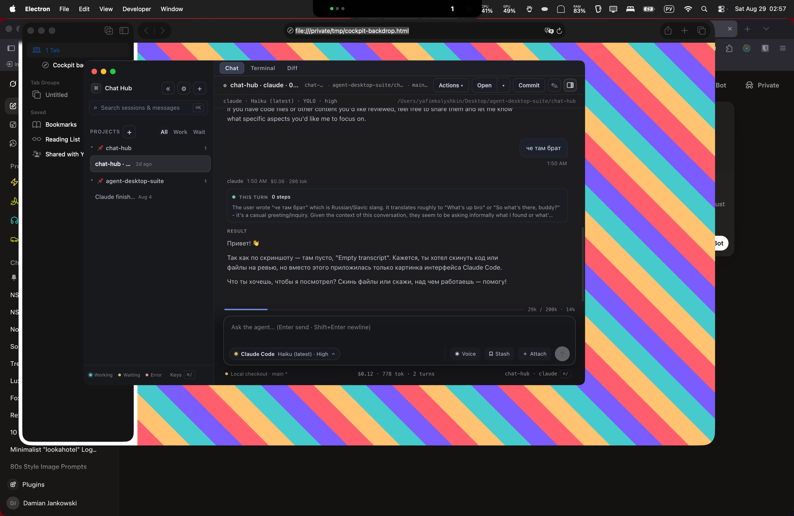
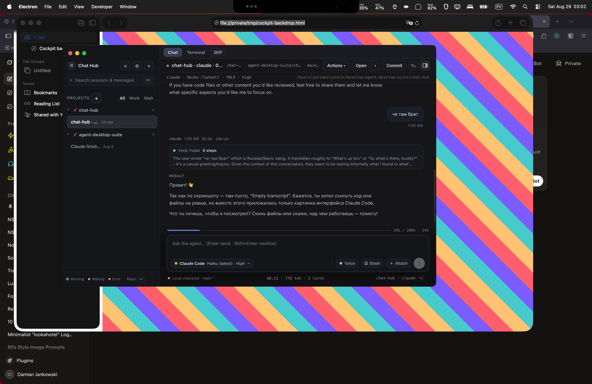
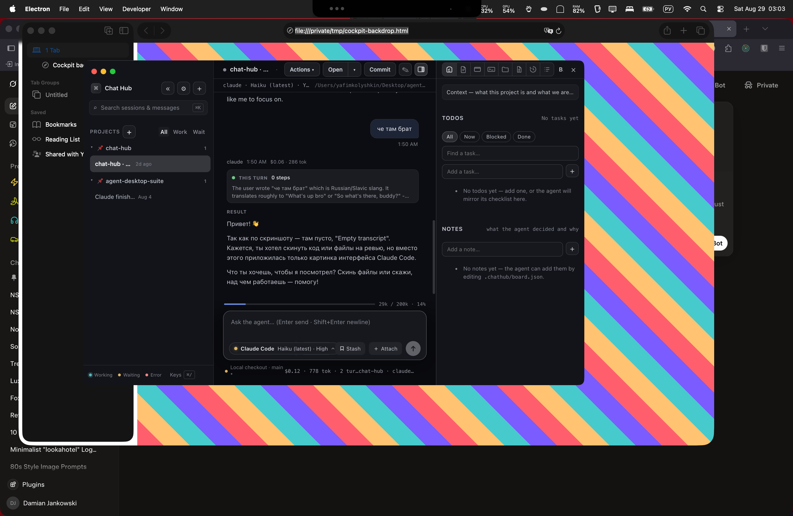
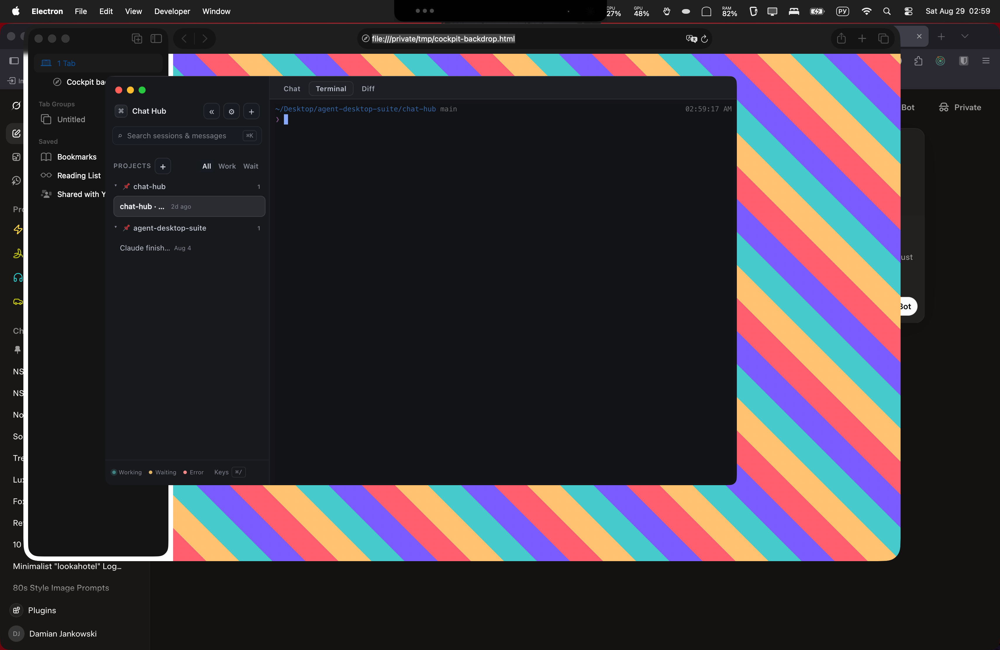
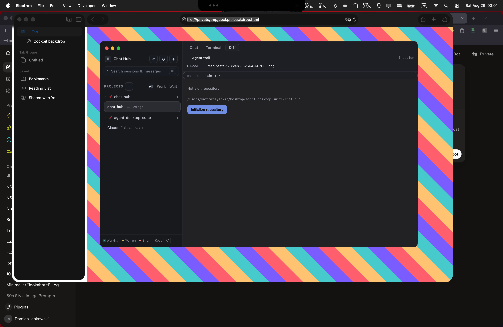

# Spike: glass cockpit (vibrancy + Glass theme + session tabs)

Throwaway on `spike/cockpit`. Off by default. Enable with `CHAT_HUB_COCKPIT=1`.

```bash
pnpm dev:cockpit          # under-window vibrancy
pnpm dev:cockpit:hud      # hud vibrancy
pnpm dev                  # normal window, unchanged
```

Developer menu: **Toggle cockpit (restart)** and **Cycle cockpit vibrancy (restart)**. Argv `--chat-hub-cockpit=0|1` overrides the env var so the toggle works even when the env var is set.

## Vibrancy

Tried on macOS, Electron 35, `titleBarStyle: hiddenInset`, traffic lights kept at `{ x: 16, y: 16 }`.

`transparent: true` was a dead end: the window went see-through **without** the system blur. The working recipe is:

- `backgroundColor: '#00000000'`
- `vibrancy: 'under-window' | 'hud'`
- `visualEffectState: 'active'`
- **no** `transparent: true`

Renderer surfaces then paint translucent rgba over that blur.

### `under-window` (default)



Desktop content (the chroma stripes) bleeds through the transcript and the sidebar edge. Closest to current macOS glass (Finder, Control Center).

### `hud`



Thicker frost. Less of the backdrop is readable; the window feels more like a floating HUD than a pane of glass. Text is a hair more stable because less chroma leaks in.

### Normal window (control)



No bleed, no tab strip, dock still opens. Confirms Glass tokens are not persisted into a normal window's boot theme.

**Pick for productizing:** `under-window`. `hud` is the fallback if we ever need a more isolated overlay (e.g. a mini inspector).

## Perf (idle, same machine, Activity Monitor-style `ps`)

Numbers are RSS and `%CPU` after ~2s idle. Menu-bar GPU% in the screenshots is **machine-wide** (Safari + Discord + this app), not Chat Hub alone.

| Mode | Main RSS | GPU helper RSS / CPU | Renderer RSS / CPU |
| --- | --- | --- | --- |
| Normal | 144 MB / 0% | 89 MB / 2.6% | 152 MB / 2.1% |
| under-window | 134 MB / 0.8% | 77 MB / 2.2% | 140 MB / 2.0% |
| hud | 143 MB / 0.9% | 92 MB / 2.1% | 155 MB / 1.8% |

No idle energy cliff. Vibrancy does not show up as a distinct GPU tax versus the opaque window at rest. A long coding session with xterm scroll + streaming markdown was not measured; that is the next thing to watch if this ships.

## Glass theme

Defined in `src/shared/theme.ts` as `GLASS_THEME` / `GLASS_SURFACE_TOKENS`. **Not** in `BUILTIN_THEMES`, so the Appearance picker never offers it. `applyTheme` overlays glass only when `<html>` has class `cockpit` (set from `?cockpit=1` before first paint). Boot snapshot still stores the user's real theme, so a later normal window does not inherit rgba surfaces.

Specified tokens:

- sidebar `rgba(19, 20, 25, 0.66)`
- elevated `rgba(26, 29, 38, 0.55)`
- borders `rgba(255, 255, 255, 0.09)` (soft/strong stepped around that)
- `--code-bg` kept at **0.88** so xterm stays a readable slab

Dim underlay: `--cockpit-dim: rgba(8, 9, 12, 0.34)` (`GLASS_DIM`). A heavier `GLASS_DIM_AA` (`0.62`) exists in code as the floor that would make `--text` / `--text-secondary` WCAG AA on **every** glass surface over a **white** desktop. That heavier dim kills the glass look, so the spike uses the lighter one.

Contrast over `#ffffff` (worst case for light text), after dim + surface composite:

- Look dim (`0.34`): `--text` on `--bg` **fails** AA (~3:1). `--text` on sidebar / elevated still **passes**.
- AA dim (`0.62`): `--text` and `--text-secondary` pass on canvas, sidebar, and elevated.
- `--text-muted` / `--text-faint` still fail on the canvas over white at both dims — same as “you cannot keep glass *and* muted-on-white AA.”

Over a dark desktop (typical for this app) look-dim contrast is fine. Productizing should **adapt the dim from wallpaper luminance**, not hard-code 0.62.

Light themes (Daylight) are forced onto midnight text + glass surfaces in a cockpit window.

## Tab strip

Chat / Terminal / Diff sit above the session column and swap the center:

- **Chat** — existing `ChatView` (kept mounted, `hidden`, so the composer draft survives)
- **Terminal** — existing `TerminalSurface`
- **Diff** — existing `DiffSurface`





The side dock is **not** rendered in cockpit (tabs replace it). Auto-open-diff / run-script still flip the tab because they write `surface` and the pane watches that.

Right inspector: skipped (time). The dock is still the place to put it later.

Tabs live in the `hiddenInset` titlebar band. Empty tab-bar chrome is `-webkit-app-region: drag`; the buttons are `no-drag`. Without that, clicks move the window.

## What breaks

- **`transparent: true`** — no vibrancy, just a hole. Do not ship that flag.
- **xterm** — fine. The terminal host is mostly opaque (`--code-bg` 0.88). Glyphs do not fray on the blur. Scroll performance was not stressed.
- **webview / Browser surface** — not in the tab strip. The dock that hosts `<webview>` is hidden in cockpit, so this spike did **not** put a guest WebContents on a vibrancy window. Expect an opaque rectangle (or a black flash) when someone wires Browser into a cockpit tab; that needs its own pass.
- **Titlebar hit testing** — tabs in the traffic-light row need `no-drag` or they never click.
- **AA vs glass** — mutually exclusive on a white wallpaper if we keep the specified alphas. Dim is the lever.
- **Tiled panes** — each pane gets the same Chat/Terminal/Diff strip. Not a per-window session-tab chrome (no “three chats as browser tabs”). That is a different spike.
- **Daylight** — cockpit always paints dark glass, even if Daylight is selected.

## Recommendation

Ship-able as a **developer / experimental** flag, not as default.

1. Keep `under-window` + `visualEffectState: 'active'` + transparent `backgroundColor`. Never `transparent: true`.
2. Keep Glass as a cockpit-only overlay, not a picker theme.
3. Productize the tab strip as session-local Chat / Terminal / Diff, with the dock remaining the overflow (Browser, Files, Board).
4. Before calling it done: (a) webview on glass, (b) 30-minute energy sample while a turn streams and xterm scrolls, (c) adaptive dim from backdrop luminance so white desktops get AA and dark desktops keep the glass.

## How to run

Env is enough. Menu toggle restarts. `CHAT_HUB_COCKPIT_VIBRANCY=hud` or the cycle-vibrancy menu item for the other material.

## Skipped

- Full `pnpm test` / `pnpm lint` (spike; ran typecheck + the cockpit/theme/contrast/boot-theme/developer-menu files)
- Right inspector column
- Adaptive dim implementation
- Webview-in-vibrancy proof
- Long-running energy sample
