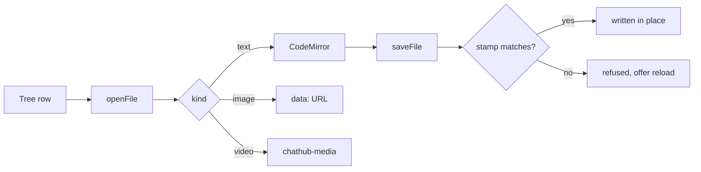

## Files surface fixture

This file exists so the markdown viewer has something with structure in it:
a heading, a list, an inline `code span`, and a diagram.

- rendered by default
- **Source** flips to the editor with a live preview
- ⌘S saves; the tree marks the file while it is dirty

### Why the stamp

The agent edits the same tree from the other side of the window. A save that
ignored the on-disk mtime would quietly throw away whatever it had just done.
